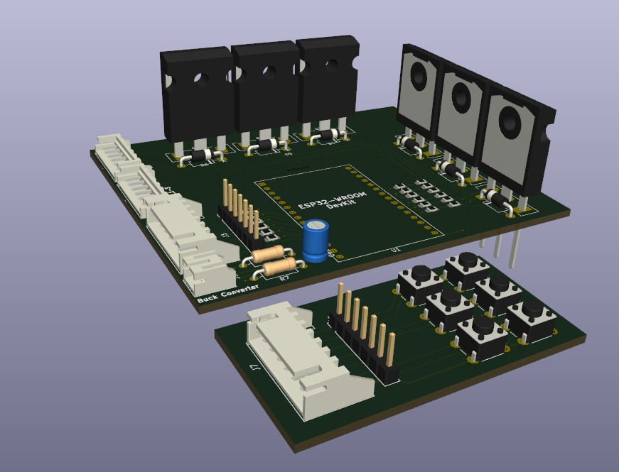
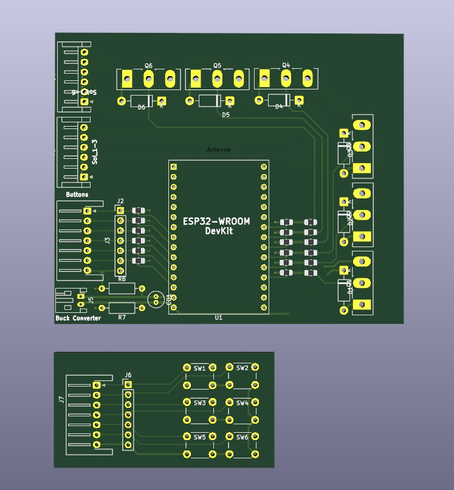
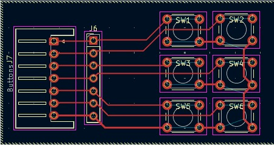
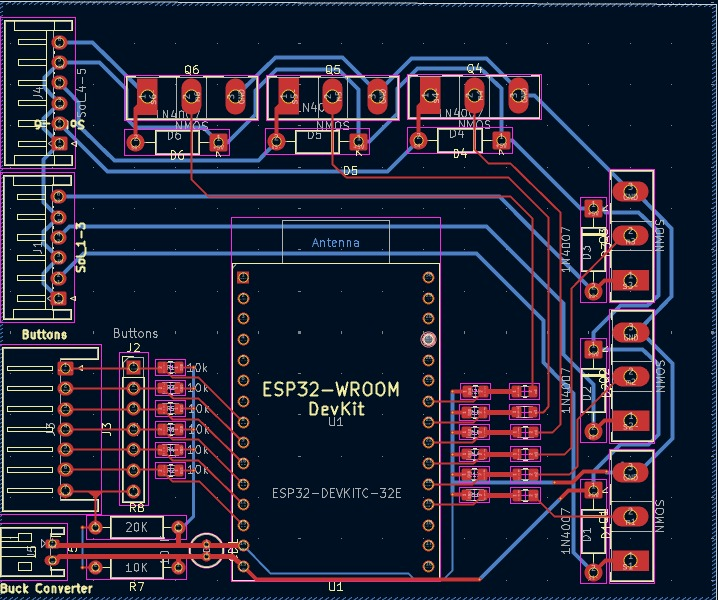

# Braille Glove — Assistive Communication Device

A wearable haptic glove that lets visually impaired users **receive and reply to Telegram messages entirely through touch** — no screen, no sighted assistance required. Incoming messages vibrate on six solenoid fingers in Grade-1 Braille. The user types replies using six Braille-dot buttons and sends them back via Telegram.

**PDPM IIITDM Jabalpur · Project EDP-26 · Patent filed**

---

## Hardware

### PCB — 3D Model



Custom two-board PCB stack designed for the glove:

- **Main board** — ESP32-WROOM-32 DevKit at the centre, six MOSFET transistor banks (top and right) driving the solenoids, a buck converter for regulated power, and solenoid output headers on the sides.
- **Button sub-board** — Six tactile switches (SW1–SW6) arranged in the standard 2×3 Braille cell layout, connected to the main board via a ribbon connector.

---

### PCB Layout



The two boards shown together. The main board carries the ESP32, all six MOSFET drivers (Q4, Q5, Q6 on top; three more on the left), the buck converter module, and solenoid wiring headers. The button board (bottom) carries SW1–SW6 wired out through J6/J7.

---

### Button Sub-Board Routing



Six tactile Braille-dot switches (SW1–SW6) arranged in a 2×3 grid mirroring the standard Braille cell. Left column = dots 1, 2, 3 (index to ring finger). Right column = dots 4, 5, 6. All six lines route through connector J6 → J7 to the main board.

---

### Main Board Routing



Full copper routing of the main board: ESP32-WROOM-32 DevKit (U1) at the centre, six MOSFET solenoid driver channels, a 10 Ω / 20 Ω resistor network for current limiting on the buck converter output, and the button input connector on the left edge.

---

## How It Works

```
Sender's Telegram
       │
       ▼
 Python Backend ──── BLE (GATT) ──── ESP32 Glove
       │                                  │
   SQLite DB                     6 solenoids (haptic)
   Message Queue                 6 Braille dot buttons
       │                         PREV · NEXT · ENTER
   FastAPI REST
       │
 React Web Dashboard
```

### Incoming Message Flow

1. A Telegram message arrives at the Python backend via bot polling.
2. It is persisted in SQLite and added to the in-memory queue.
3. If the glove is connected over BLE, the message text is encoded into Grade-1 Braille and sent as a sequence of haptic pulses — one 2-byte packet per cell.
4. The ESP32 drives each solenoid channel through a MOSFET, vibrating the corresponding dots on the user's fingers.

### Outgoing Reply Flow

1. The user double-taps NEXT to enter **Compose mode** (confirmed by a distinct haptic cue).
2. Each Braille chord tap (one or more dot buttons held together) is decoded to a letter and appended to the reply text.
3. PREV/NEXT cycles through saved contacts (up to 10 favourites). The selected contact name plays back as Braille.
4. ENTER sends the composed message to the selected contact's Telegram chat.

---

## Session State Machine

| Mode | Button | Action |
|---|---|---|
| **READ** | PREV single | Previous message |
| **READ** | NEXT single | Next message |
| **READ** | ENTER | Mark current as read |
| **READ** | PREV double | Jump to oldest unread |
| **READ** | NEXT double | → Enter **COMPOSE** |
| **COMPOSE** | Braille chord | Append decoded letter |
| **COMPOSE** | PREV / NEXT single | Cycle contacts |
| **COMPOSE** | ENTER | Send via Telegram |
| **COMPOSE** | PREV double | Backspace |
| **COMPOSE** | NEXT double | → Back to **READ** |

---

## BLE Protocol

**Service UUID:** `a1b2c3d4-0001-4e5f-8000-000000000001`

| Characteristic | UUID | Direction |
|---|---|---|
| HAPTIC_OUTPUT | `...0002` | Backend → ESP32 |
| BUTTON_INPUT | `...0003` | ESP32 → Backend (notify) |

**Haptic packet (2 bytes):**
```
byte[0]  dot_mask   bits 0–5 = Braille dots 1–6; bits 6–7 = special cell flag
byte[1]  duration   actual_ms = value × 10
```

**Button packet:**
```
Non-Braille (1 byte):  high nibble = button type (PREV=1, NEXT=2, ENTER=3)
                        low  nibble = event type  (SINGLE=0, DOUBLE=1)
Braille     (2 bytes): 0x00, 6-bit dot mask
```

---

## Repository Layout

```
EDP-26/
├── backend/
│   ├── braille/        Grade-1 codec — charset, encode, decode
│   ├── ble/            Wire format + Bleak BLE manager
│   ├── device/         AbstractDevice · ESP32Device · SimulatorDevice
│   ├── messaging/      AbstractMessaging · TelegramMessaging · MockMessaging
│   ├── db/             SQLAlchemy 2.0 async — models, engine, repository
│   ├── core/           QueueManager · SessionManager state machine
│   ├── api/            FastAPI REST API
│   │   └── routes/     messages · contacts · device · testing
│   ├── tests/          Full test suite (no hardware needed)
│   └── main.py         Entry point — wires everything together
├── frontend/
│   └── src/
│       ├── components/ Dashboard · Inbox · Contacts · Test Lab
│       ├── api/        Typed fetch client
│       └── hooks/      usePolling
└── docs/
    ├── assets/         PCB photos and 3D renders
    └── protocol.md     BLE wire format reference
```

---

## Getting Started

### Requirements

- Python 3.11+ (recommend `pyenv`)
- Node.js 18+

### Backend

```bash
cd backend

# Install
pip install -e ".[dev]"

# Configure (copy and add your Telegram bot token)
cp .env.example .env

# Run  (works without token — falls back to mock mode for testing)
python main.py
```

### Frontend

```bash
cd frontend
npm install
npm run dev
# Open http://localhost:5173
```

### Tests (no hardware, no Telegram token needed)

```bash
cd backend
pytest
```

---

## Web Dashboard

| Tab | Description |
|---|---|
| **Dashboard** | BLE connection status, current mode, queue stats |
| **Inbox** | All messages — filter by read/unread, delete |
| **Contacts** | Manage up to 10 favourite recipients (slots 0–9) |
| **Test Lab** | Inject fake messages · Simulate glove button presses · Select contact · Live activity log |

---

## Environment Variables

| Variable | Default | Description |
|---|---|---|
| `TELEGRAM_TOKEN` | — | Bot token from BotFather (optional) |
| `TELEGRAM_ALLOWED_IDS` | `[]` | Comma-separated chat IDs allowed to message the bot |
| `DATABASE_URL` | `sqlite+aiosqlite:///./braille_glove.db` | Async DB URL |
| `API_HOST` | `0.0.0.0` | Uvicorn bind host |
| `API_PORT` | `8000` | Uvicorn port |
| `BLE_SCAN_TIMEOUT` | `10.0` | BLE device scan timeout (seconds) |

---

## Tech Stack

**Backend:** Python 3.11 · FastAPI · SQLAlchemy 2.0 async · aiosqlite · Bleak · python-telegram-bot v21 · pydantic-settings · pytest-asyncio

**Frontend:** Vite · React 18 · TypeScript · Space Mono + VT323

**Hardware:** ESP32-WROOM-32 · Custom 2-layer PCB · MOSFET solenoid drivers · Buck converter

---

## Institution

PDPM Indian Institute of Information Technology, Design and Manufacturing, Jabalpur — Project EDP-26
